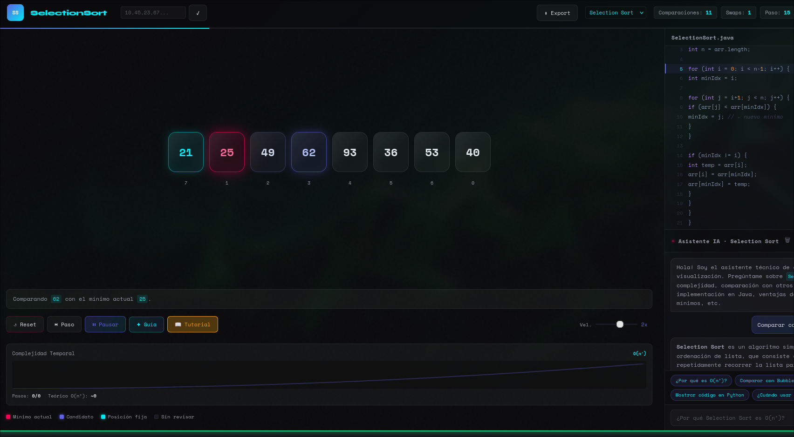
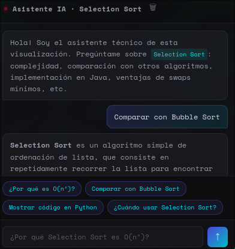

# 🎯 Visual Sorting With AI - NikoSysDev

<p align="center">
  
  
  
</p>

**Visual Sorting With AI** es una plataforma de visualización algorítmica de alto impacto que fusiona la lógica computacional con inteligencia artificial contextual. Diseñada bajo una estética **Cyberpunk**, este proyecto no solo ilustra el ordenamiento de datos, sino que ofrece un asistente inteligente que analiza el estado del simulador en tiempo real.

---

## 📸 Demo Visual

<p align="center">
  
</p>

### 🧠 Inteligencia Artificial en Acción
El asistente IA utiliza el contexto del algoritmo para explicar cada movimiento. No es una respuesta genérica; es una explicación basada en los datos actuales del array.

<p align="center">
  
</p>

---

## ⚠️ Nota Importante sobre la API
> [!WARNING]
> Este proyecto utiliza una integración con la API de **OpenRouter**. Dado que se utiliza un modelo de acceso gratuito para esta demostración, es posible que experimente latencia o errores de respuesta en momentos de **tráfico excesivo**.

---

## 🌟 Características Principales

* **Motor GSAP 3.12**: Animaciones fluidas de 60fps con trayectorias curvas para los intercambios (*swaps*).
* **Sincronización de Código**: Resaltado de sintaxis Java en tiempo real que sigue la ejecución lógica.
* **Complexity Chart**: Gráfico dinámico mediante **Canvas API** que proyecta la curva $O(n^2)$.
* **Exportación JSON**: Descarga el log de pasos y estadísticas finales para análisis académico.

---

## 🏗️ Arquitectura Técnica

El sistema está construido bajo un patrón **Decoupled MVC** en Vanilla JavaScript para maximizar el rendimiento.

| Módulo | Responsabilidad |
| :--- | :--- |
| `engine.js` | Lógica pura de algoritmos (Selection, Bubble, Insertion). |
| `visualizer.js` | Renderizado del DOM y orquestación de animaciones GSAP. |
| `ai-assistant.js` | Comunicación asíncrona con OpenRouter API. |
| `main.js` | Gestión del estado global (`AppState`) y eventos. |

---

## 🔧 Instalación y Uso

1. **Clonación**:
   ```bash
   git clone [https://github.com/NikkoWebDev/Visual-Sorting-With-AI.git](https://github.com/NikkoWebDev/Visual-Sorting-With-AI.git)
   Servidor Local:
2. Abre el proyecto con Live Server en VS Code o usa npx serve . para habilitar los módulos ES6.
